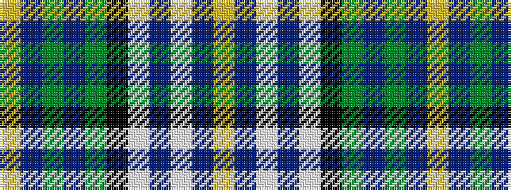

YBGBGKWBWBY

It is a 11 stripe tartan.

<figure class="pat-woven">

<figcaption>idealised sample</figcaption>
</figure>

## Colour Sequence



## Tartans with this colour sequence

| Tartans |
|---------------|
| [Robinson, Barbara Ann (Personal)](/variants/s11/ly1db8g1db1g8k1w8b1w1b8ly1~x4/)|
||
