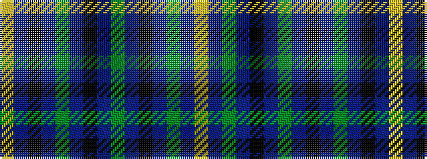

YBGBKBGBKBGBKBY

It is a 15 stripe tartan.

<figure class="pat-woven">

<figcaption>idealised sample</figcaption>
</figure>

## Colour Sequence



## Tartans with this colour sequence

| Tartans |
|---------------|
| [Kerry Irish County Tartan Tartan Number: 2263. Earliest known date: 1993 One of a series of Irish District tartans designed by Polly Wittering of the House of Edgar, with colours reminiscent of the Country with soft warm colours dominating.. See products available Copyright © Blair Urquhart, Comrie, 2015](/setts/s15/ly2n3k3n4y16n3k3n4y3n3k16n4y3n3ly2~x2/)|
||
