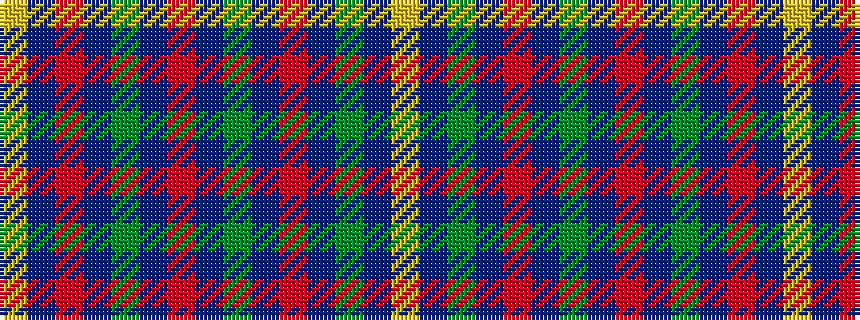

YBGBRBGBRBGBRBY

It is a 15 stripe tartan.

<figure class="pat-woven">

<figcaption>idealised sample</figcaption>
</figure>

## Colour Sequence



## Tartans with this colour sequence

| Tartans |
|---------------|
| [Kerry](/setts/s15/ly2db3o3db4g16db3o3db4g3db3o16db4g3db3ly2~x2/)|
||
