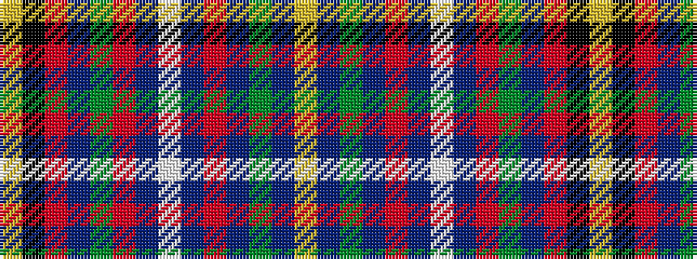

YBGBRBWBRGBRKY

It is a 14 stripe tartan.

<figure class="pat-woven">

<figcaption>idealised sample</figcaption>
</figure>

## Colour Sequence



## Tartans with this colour sequence

| Tartans |
|---------------|
| [Olympicana](/setts/s14/lo2k2r2db2g23r24db2lb2db2r2db27g6db2lo2~x2/)|
||
