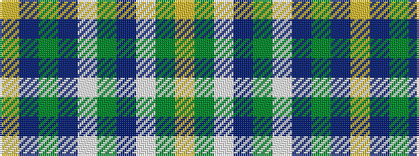

YBGBWGBWGY

It is a 10 stripe tartan.

<figure class="pat-woven">

<figcaption>idealised sample</figcaption>
</figure>

## Colour Sequence



## Tartans with this colour sequence

| Tartans |
|---------------|
| [Kerry County Crest (Fashion)](/variants/s10/ly14db5g25db5w2g11db7w5g6ly5~x2/)|
||
