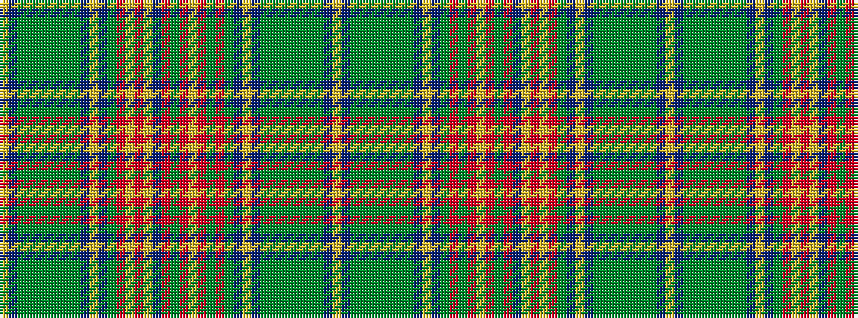

YBGGGGGGGBYBGRGRYRGRBYRYRGBYBGGGGGGGBY

It is a 38 stripe tartan.

<figure class="pat-woven">

<figcaption>idealised sample</figcaption>
</figure>

## Colour Sequence



## Tartans with this colour sequence

| Tartans |
|---------------|
| [New Brunswick variation Canadian Tartan](/variants/s38/ly2t2gi1g2gi2g2gi2g2gi2t2ly2t2gi28r24ly1o2ly3t4r10dy16r4ly2r14dy5r10gi28t2ly2t2gi1g2gi2g2gi2g2gi1t2ly2/)|
||
