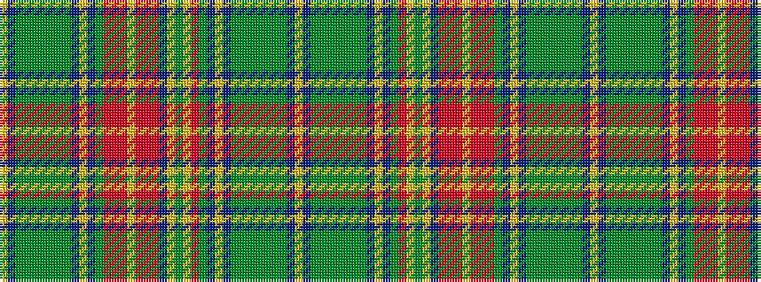

YBGGGGGGGBYBGRRRYRRRBYGYRGBYBGGGGGGGBY

It is a 38 stripe tartan.

<figure class="pat-woven">

<figcaption>idealised sample</figcaption>
</figure>

## Colour Sequence



## Tartans with this colour sequence

| Tartans |
|---------------|
| [New Brunswick, variation](/setts/s38/ly2t2g1g2g2g2g2g2g2t2ly2t2g28r24ly1y2ly3t4r10o16r4ly2r14o5r10g28t2ly2t2g1g2g2g2g2g2g1t2ly2/)|
||
