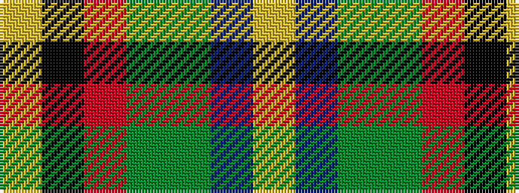

YBGGRKY

It is a 7 stripe tartan.

<figure class="pat-woven">

<figcaption>idealised sample</figcaption>
</figure>

## Colour Sequence



## Tartans with this colour sequence

| Tartans |
|---------------|
| [Young Enterprise Scotland](/variants/s7/ly3k8o3g4gi4dt22lyi2~x2/)|
||
