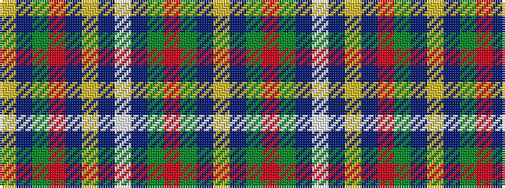

YBGRBYBWBGRGBY

It is a 14 stripe tartan.

<figure class="pat-woven">

<figcaption>idealised sample</figcaption>
</figure>

## Colour Sequence



## Tartans with this colour sequence

| Tartans |
|---------------|
| [Benteau na mara (Name)](/variants/s14/ly1dt2dg20r3dt30ly1dt30lb3db9dg4r3dg4dt2ly1~x2/)|
||
