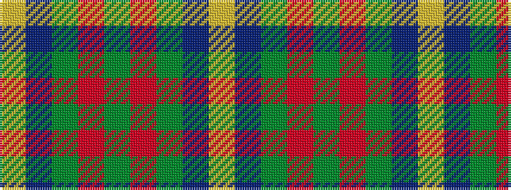

YBGRGRGBY

It is a 9 stripe tartan.

<figure class="pat-woven">

<figcaption>idealised sample</figcaption>
</figure>

## Colour Sequence



## Tartans with this colour sequence

| Tartans |
|---------------|
| [MacFie Hunting (Clan?)](/setts/s9/lr1do12g2r2g16r2g2do12lo1~x4/)|
||
