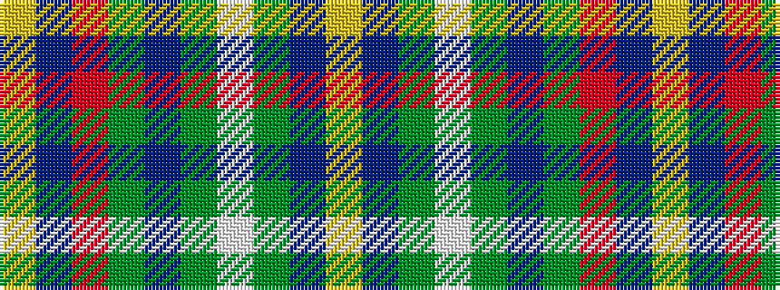

YBGWGBGRBY

It is a 10 stripe tartan.

<figure class="pat-woven">

<figcaption>idealised sample</figcaption>
</figure>

## Colour Sequence



## Tartans with this colour sequence

| Tartans |
|---------------|
| [Oxford University Dress (Corporate)](/setts/s10/ly4db44g5w2g2db2g2r2db3ly3~x2/)|
||
