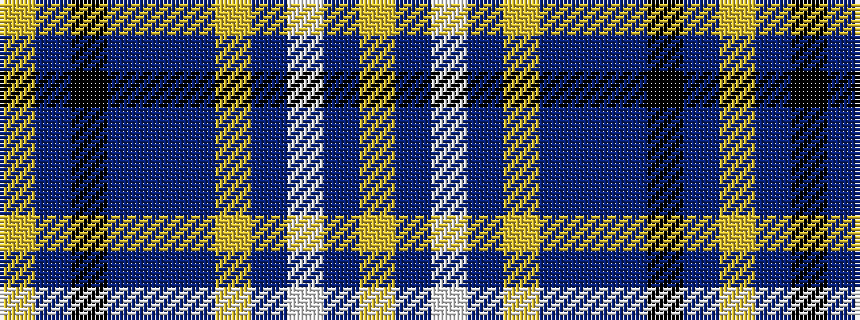

YBKBBBYBWBY

It is a 11 stripe tartan.

<figure class="pat-woven">

<figcaption>idealised sample</figcaption>
</figure>

## Colour Sequence



## Tartans with this colour sequence

| Tartans |
|---------------|
| [Bennet Dress](/setts/s11/lr64db18lb2db3lr2db3n14b8k2b4lr2~x2/)|
||
