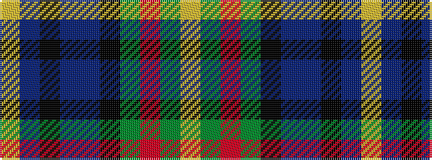

YBKBBKGRGY

It is a 10 stripe tartan.

<figure class="pat-woven">

<figcaption>idealised sample</figcaption>
</figure>

## Colour Sequence



## Tartans with this colour sequence

| Tartans |
|---------------|
| [RAF Leuchars](/variants/s10/lr2y11r2y11k2db6b13k2b3ly2~x4/)|
||
