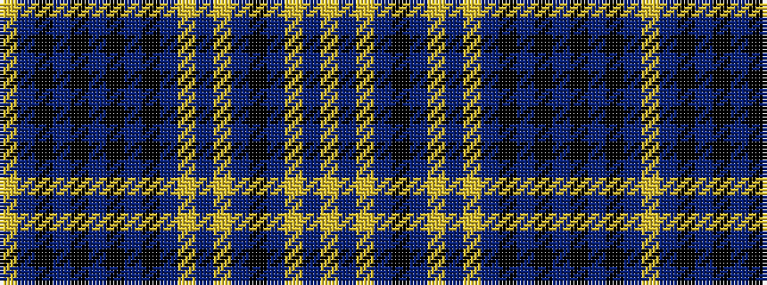

YBKBKBKBKBYBYBKBYBY

It is a 19 stripe tartan.

<figure class="pat-woven">

<figcaption>idealised sample</figcaption>
</figure>

## Colour Sequence



## Tartans with this colour sequence

| Tartans |
|---------------|
| [Ferrari (Coldrerio)](/variants/s19/ly6n2lyi2n1k1n1lo4ni2lo2n17k2ni3k8ni3k2ni17k2ni2lo2~x2/)|
||
| [Ferrari (Name)](/variants/s19/ly6db2lo2db1k1db1lyi4t2lyi2db17k2t3k8t3k2t17k2t2lyi2~x2/)|
||
