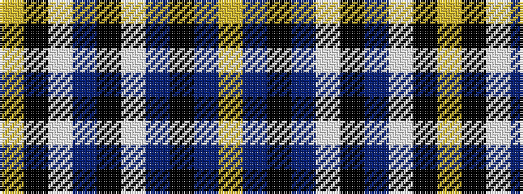

YBKBWKBWKY

It is a 10 stripe tartan.

<figure class="pat-woven">

<figcaption>idealised sample</figcaption>
</figure>

## Colour Sequence



## Tartans with this colour sequence

| Tartans |
|---------------|
| [Cavan County Crest (Fashion)](/setts/s10/lo32db10k52db10w5k24db16w10k11lo15/)|
||
