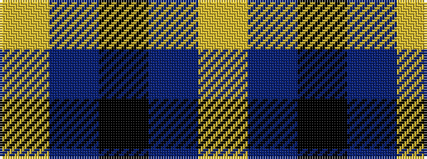

YBKBY

It is a 5 stripe tartan.

<figure class="pat-woven">

<figcaption>idealised sample</figcaption>
</figure>

## Colour Sequence



## Tartans with this colour sequence

| Tartans |
|---------------|
| [The Poulain League](/variants/s5/ly6b38k3b38ly6~x2/)|
||
