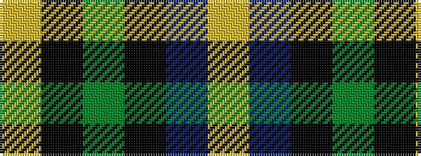

YBKGKY

It is a 6 stripe tartan.

<figure class="pat-woven">

<figcaption>idealised sample</figcaption>
</figure>

## Colour Sequence



## Tartans with this colour sequence

| Tartans |
|---------------|
| [MacNiel of Barra](/setts/s6/lr3db14k12dg12k2ly3~x2/)|
||
| [MacNiel of Barra](/setts/s6/lr3db14k12dg12k2ly3/)|
||
