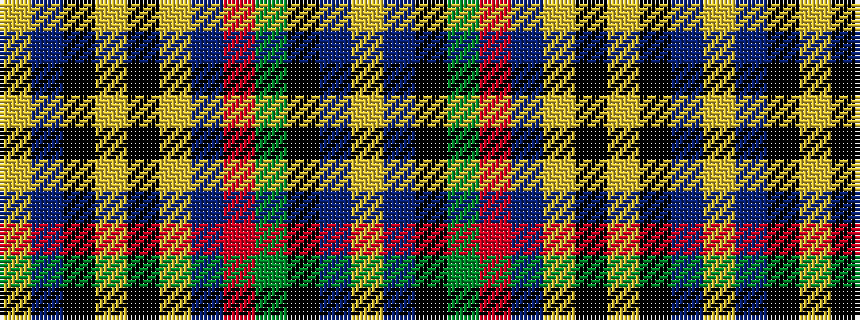

YBKGRBYKYKBY

It is a 12 stripe tartan.

<figure class="pat-woven">

<figcaption>idealised sample</figcaption>
</figure>

## Colour Sequence



## Tartans with this colour sequence

| Tartans |
|---------------|
| [Talisman](/variants/s12/lr2db3k3g8r6db2lo2k3lr2k6db8lo2~x2/)|
||
| [Talisman (Fashion)](/variants/s12/lr2db3k3g8r6db2lo2k3lr2k6db32lo2~x2/)|
||
