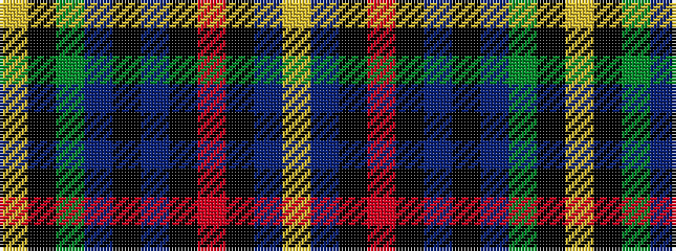

YBKRKBKBGKY

It is a 11 stripe tartan.

<figure class="pat-woven">

<figcaption>idealised sample</figcaption>
</figure>

## Colour Sequence



## Tartans with this colour sequence

| Tartans |
|---------------|
| [Montreat](/setts/s11/lo2n10k2r5k2n19k2n19g17k2lo2~x2/)|
||
