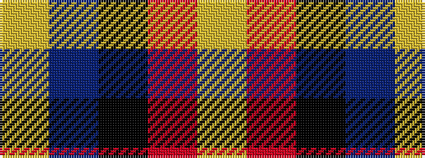

YBKRY

It is a 5 stripe tartan.

<figure class="pat-woven">

<figcaption>idealised sample</figcaption>
</figure>

## Colour Sequence



## Tartans with this colour sequence

| Tartans |
|---------------|
| [Aberdeen University](/variants/s5/ly2r15k7db8ly2~x4/)|
||
| [Aberdeen University (1992)](/variants/s5/ly4r27k12db15ly4~x2/)|
||
