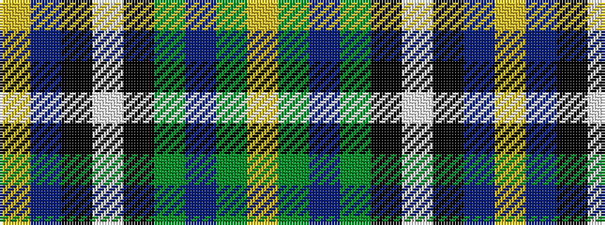

YBKWKGBGY

It is a 9 stripe tartan.

<figure class="pat-woven">

<figcaption>idealised sample</figcaption>
</figure>

## Colour Sequence



## Tartans with this colour sequence

| Tartans |
|---------------|
| [Clyde (WCWM Fashion)](/variants/s9/lo2n28k2w2k2g26n3g5lo2~x2/)|
||
