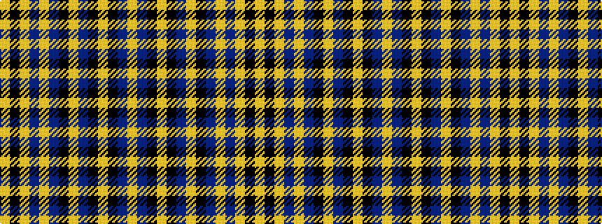

YBKYKBYKBYBYKY

It is a 14 stripe tartan.

<figure class="pat-woven">

<figcaption>idealised sample</figcaption>
</figure>

## Colour Sequence



## Tartans with this colour sequence

| Tartans |
|---------------|
| [Agincourt](/variants/s14/lo4k1lo3dt1lo1dt2k6lo4dt2k6lo7k6dt29lo2~x4/)|
||
