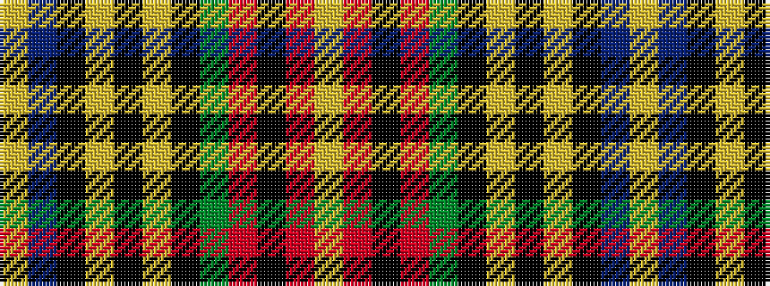

YBKYKYKGRKRY

It is a 12 stripe tartan.

<figure class="pat-woven">

<figcaption>idealised sample</figcaption>
</figure>

## Colour Sequence



## Tartans with this colour sequence

| Tartans |
|---------------|
| [Stewart Dress](/setts/lr36db4k6ly1k1lr1k1dg8r4k1r2lr1/)|
||
