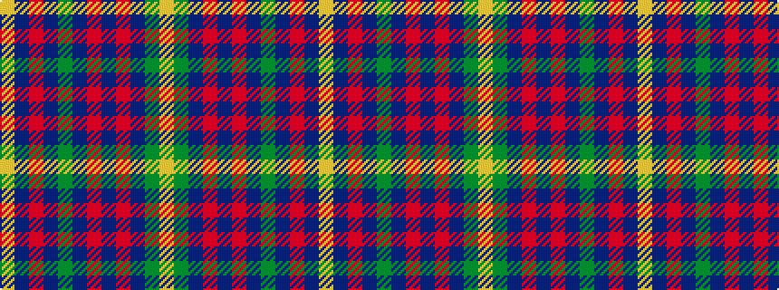

YBRBGBRBRBGY

It is a 12 stripe tartan.

<figure class="pat-woven">

<figcaption>idealised sample</figcaption>
</figure>

## Colour Sequence



## Tartans with this colour sequence

| Tartans |
|---------------|
| [Meath, County](/variants/s12/lo5db2r14do9dg8db3r3db3r3db3dg18ly3~x2/)|
||
