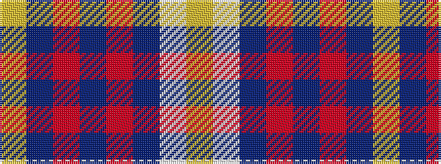

YBRBRBWY

It is a 8 stripe tartan.

<figure class="pat-woven">

<figcaption>idealised sample</figcaption>
</figure>

## Colour Sequence



## Tartans with this colour sequence

| Tartans |
|---------------|
| [Aberdeen F.C. Corporate Tartan](/variants/s8/lo5dt1r2dt4r36dt22w4ly2~x2/)|
||
