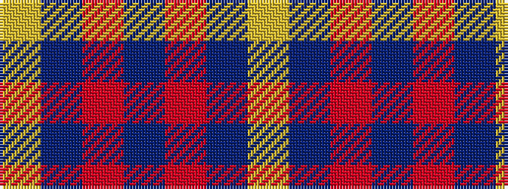

YBRBRBY

It is a 7 stripe tartan.

<figure class="pat-woven">

<figcaption>idealised sample</figcaption>
</figure>

## Colour Sequence



## Tartans with this colour sequence

| Tartans |
|---------------|
| [Lion Brand Sportswear](/setts/s7/lr4dt1r15dt42r6dt4lo1~x2/)|
||
