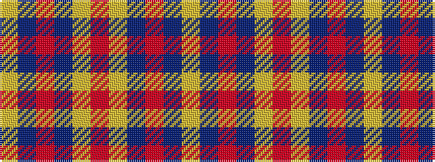

YBRBYRYBRBY

It is a 11 stripe tartan.

<figure class="pat-woven">

<figcaption>idealised sample</figcaption>
</figure>

## Colour Sequence



## Tartans with this colour sequence

| Tartans |
|---------------|
| [Bell's](/variants/s11/ly3dt4r12dt27ly2r65ly2dt27r12dt4ly3~x2/)|
||
| [Bell's (Corporate)](/variants/s11/ly6dt8r24dt54ly4r130ly4dt54r24dt8ly3/)|
||
