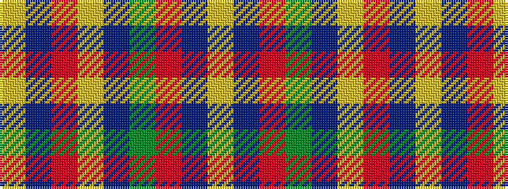

YBRGBYRBY

It is a 9 stripe tartan.

<figure class="pat-woven">

<figcaption>idealised sample</figcaption>
</figure>

## Colour Sequence



## Tartans with this colour sequence

| Tartans |
|---------------|
| [Monaghan](/setts/s9/lo3dr2o14g17dr14lo8o14dr2lo3~x2/)|
||
| [Monaghan, County (District)](/setts/s9/lo3do2o14lo8do14dg16o13do2lo3~x2/)|
||
