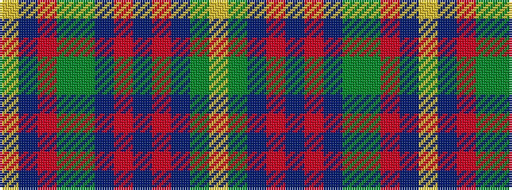

YBRGGBRBRBGY

It is a 12 stripe tartan.

<figure class="pat-woven">

<figcaption>idealised sample</figcaption>
</figure>

## Colour Sequence



## Tartans with this colour sequence

| Tartans |
|---------------|
| [Meath Irish County Tartan](/variants/s12/lo5n2o14dy9dg8n3o3n3o3n3dg19ly3~x2/)|
||
