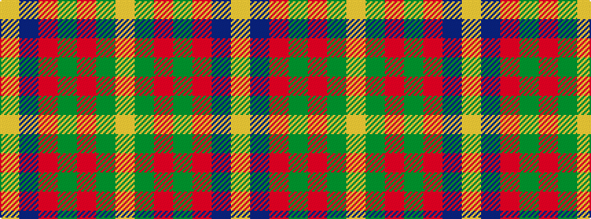

YBRGRGY

It is a 7 stripe tartan.

<figure class="pat-woven">

<figcaption>idealised sample</figcaption>
</figure>

## Colour Sequence



## Tartans with this colour sequence

| Tartans |
|---------------|
| [Abernethy (Colerain USA) (Personal)](/variants/s7/lo1db14r28g14r1g14lo1~x2/)|
||
| [Abernethy (Colerain, USA)](/variants/s7/lo1dg14r1y14r28db14lo1~x2/)|
||
