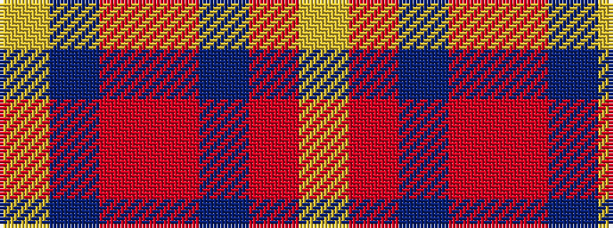

YBRRBRY

It is a 7 stripe tartan.

<figure class="pat-woven">

<figcaption>idealised sample</figcaption>
</figure>

## Colour Sequence



## Tartans with this colour sequence

| Tartans |
|---------------|
| [Deeside District](/setts/s7/ly1b4o1o5dr2o1ly1~x2/)|
||
