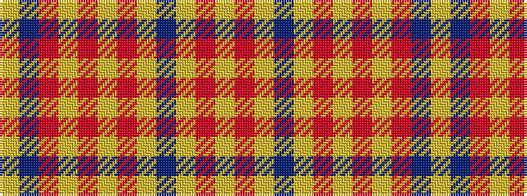

YBRYRYRYBYRY

It is a 12 stripe tartan.

<figure class="pat-woven">

<figcaption>idealised sample</figcaption>
</figure>

## Colour Sequence



## Tartans with this colour sequence

| Tartans |
|---------------|
| [Carsaig](/setts/s12/lr12r3lr3db4lr16o3lr3o3lr3o16db52lr4/)|
||
