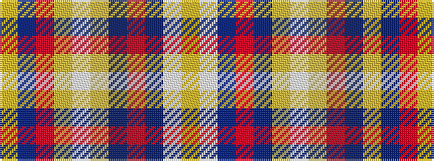

YBRYWYBRBWY

It is a 11 stripe tartan.

<figure class="pat-woven">

<figcaption>idealised sample</figcaption>
</figure>

## Colour Sequence



## Tartans with this colour sequence

| Tartans |
|---------------|
| [Unidentified #55](/setts/s11/lo2db10r3lo2lb3lo2db3r3db3lb3lo2~x4/)|
||
