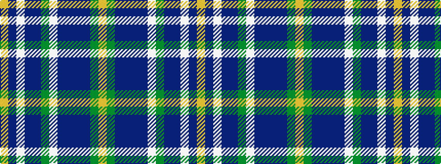

YBWBBGWBBBBGY

It is a 13 stripe tartan.

<figure class="pat-woven">

<figcaption>idealised sample</figcaption>
</figure>

## Colour Sequence



## Tartans with this colour sequence

| Tartans |
|---------------|
| [Enable (Corporate)](/variants/s13/ly3g4n14dp3n2dp18lb16g14n2dp3lb3n2lo1~x2/)|
||
