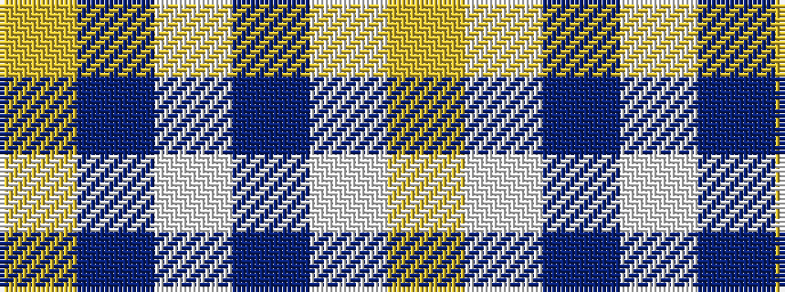

YBWBWY

It is a 6 stripe tartan.

<figure class="pat-woven">

<figcaption>idealised sample</figcaption>
</figure>

## Colour Sequence



## Tartans with this colour sequence

| Tartans |
|---------------|
| [Legary](/setts/s6/ly5db15lb5db5lb40ly3~x2/)|
||
