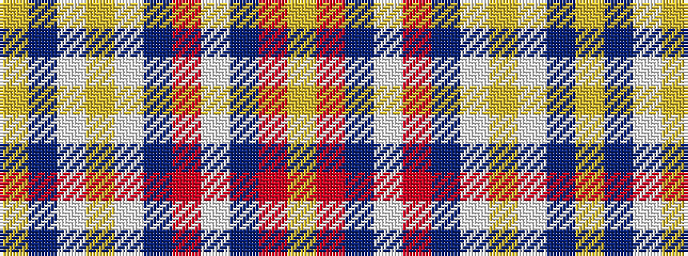

YBWYWBRWBRY

It is a 11 stripe tartan.

<figure class="pat-woven">

<figcaption>idealised sample</figcaption>
</figure>

## Colour Sequence



## Tartans with this colour sequence

| Tartans |
|---------------|
| [Unidentified](/variants/s11/lo4t2lb2lo2lb2t2r2lb5t5r5lo2~x8/)|
||
