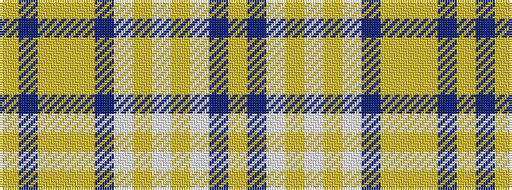

YBWYWYWBYYYBY

It is a 13 stripe tartan.

<figure class="pat-woven">

<figcaption>idealised sample</figcaption>
</figure>

## Colour Sequence



## Tartans with this colour sequence

| Tartans |
|---------------|
| [Morag](/setts/s13/lr64n4lr4lo4lr4n26lb4lo1lb2lo1lb32n2lo4~x2/)|
||
