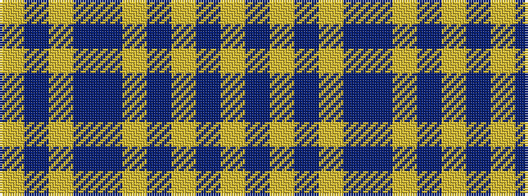

YBYBBYBYBY

It is a 10 stripe tartan.

<figure class="pat-woven">

<figcaption>idealised sample</figcaption>
</figure>

## Colour Sequence



## Tartans with this colour sequence

| Tartans |
|---------------|
| [Rhys (Welsh Name)](/variants/s10/lo6db3lo3db15dbi7lo7dbi5lo17dbi46lo4/)|
||
