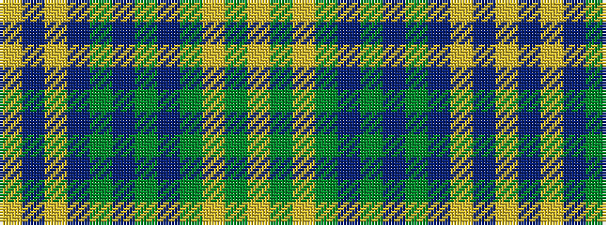

YBYBGBGBGYGY

It is a 12 stripe tartan.

<figure class="pat-woven">

<figcaption>idealised sample</figcaption>
</figure>

## Colour Sequence



## Tartans with this colour sequence

| Tartans |
|---------------|
| [Yarmouth NS (District)](/setts/s12/lo2t2lo1t18y2t10y10t2y18ly1y2ly2~x2/)|
||
