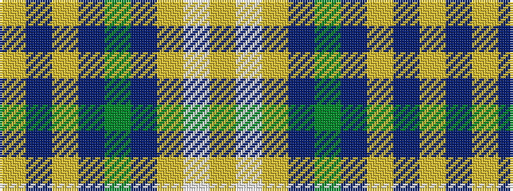

YBYBGBYWY

It is a 9 stripe tartan.

<figure class="pat-woven">

<figcaption>idealised sample</figcaption>
</figure>

## Colour Sequence



## Tartans with this colour sequence

| Tartans |
|---------------|
| [WestJet](/setts/s9/ly3lb6lg20dt5g3dt15ly3dt3lg3~x2/)|
||
