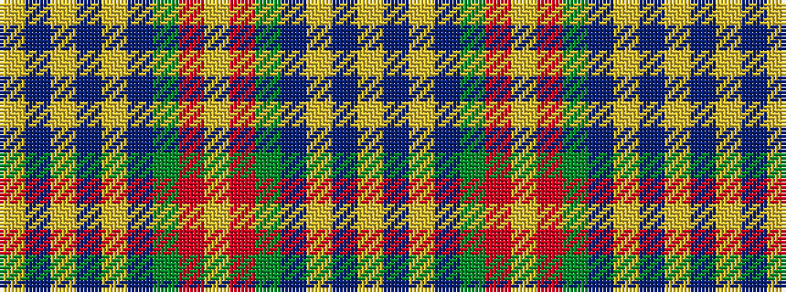

YBYBGRYRGBYBYBY

It is a 15 stripe tartan.

<figure class="pat-woven">

<figcaption>idealised sample</figcaption>
</figure>

## Colour Sequence



## Tartans with this colour sequence

| Tartans |
|---------------|
| [Lander (2013)](/variants/s15/lo18do3lo3do3lo3do16y16r2ly2r2y16do16lo17do3lo3~x2/)|
||
