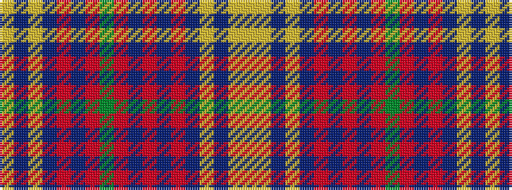

YBYBRBRGRBRBRBYBYY

It is a 18 stripe tartan.

<figure class="pat-woven">

<figcaption>idealised sample</figcaption>
</figure>

## Colour Sequence



## Tartans with this colour sequence

| Tartans |
|---------------|
| [Macallan The](/variants/s18/lo74do6lo6do8r6do6r71dg6r6db6r71do6r6do8lo6do6lo74ly8/)|
||
