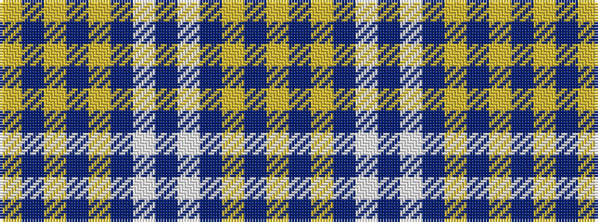

YBYBWBWBYBYBY

It is a 13 stripe tartan.

<figure class="pat-woven">

<figcaption>idealised sample</figcaption>
</figure>

## Colour Sequence



## Tartans with this colour sequence

| Tartans |
|---------------|
| [Brown Watch Dress](/setts/s13/lo20do3lo3do3lo3do9w10do3w1do9lo10do3lo3~x2/)|
||
