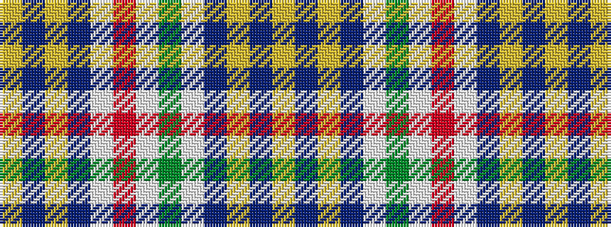

YBYBWGWRWBYBY

It is a 13 stripe tartan.

<figure class="pat-woven">

<figcaption>idealised sample</figcaption>
</figure>

## Colour Sequence



## Tartans with this colour sequence

| Tartans |
|---------------|
| [Aelfleda Arisaid (Personal)](/setts/s13/ly4db5ly4db5w8r2w24g2w8db5ly4db5ly4~x2/)|
||
| [Aelfleda Arisaid (Personal)](/setts/s13/ly4db5ly4db5lb8dg2lb24r2lb8db5ly4db5ly4~x2/)|
||
