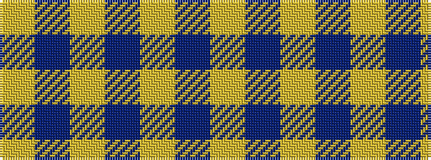

YBYBYBY

It is a 7 stripe tartan.

<figure class="pat-woven">

<figcaption>idealised sample</figcaption>
</figure>

## Colour Sequence



## Tartans with this colour sequence

| Tartans |
|---------------|
| [Lewis (Welsh Name)](/setts/s7/lo56db2lo19db1lo2db1lo2~x2/)|
||
