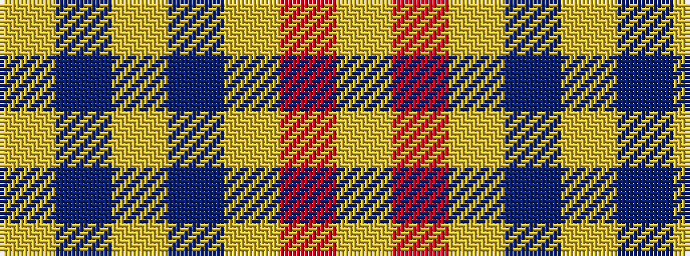

YBYBYRY

It is a 7 stripe tartan.

<figure class="pat-woven">

<figcaption>idealised sample</figcaption>
</figure>

## Colour Sequence



## Tartans with this colour sequence

| Tartans |
|---------------|
| [Dominion (Fashion)](/setts/s7/lg6r1lg17db3lg3db8lg1~x2/)|
||
