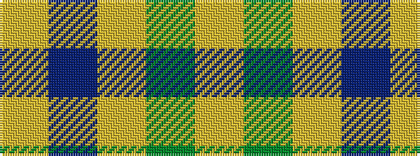

YBYGY

It is a 5 stripe tartan.

<figure class="pat-woven">

<figcaption>idealised sample</figcaption>
</figure>

## Colour Sequence



## Tartans with this colour sequence

| Tartans |
|---------------|
| [Burt's Highlanders (Fashion)](/setts/s5/lo40g13lo6db13lo22~x2/)|
||
