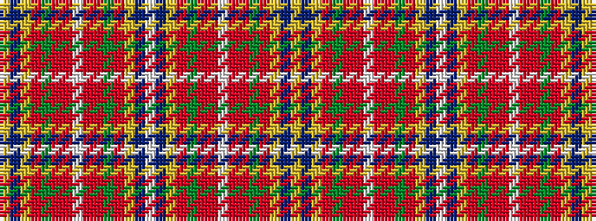

YBYRGRRWRRGRYBWBYRGRRWRRGRYBY

It is a 29 stripe tartan.

<figure class="pat-woven">

<figcaption>idealised sample</figcaption>
</figure>

## Colour Sequence



## Tartans with this colour sequence

| Tartans |
|---------------|
| [Wisconsin in Scotland](/variants/s29/ly1db22ly2m4y2m4r4w2r4m4y2m4ly2db22w2db22ly2m4y2m4r4w2r4m4y2m4ly2db22ly1/)|
||
