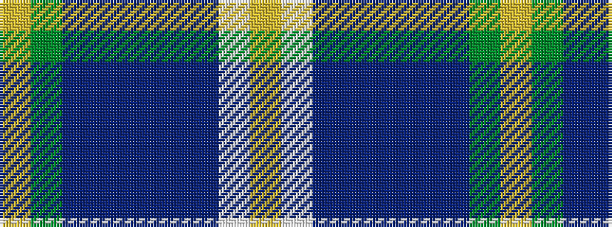

YGBBBBBWY

It is a 9 stripe tartan.

<figure class="pat-woven">

<figcaption>idealised sample</figcaption>
</figure>

## Colour Sequence



## Tartans with this colour sequence

| Tartans |
|---------------|
| [Scotland’s Golf Coast](/variants/s9/lo2dg20db8dp3db2dp2db16w1lg2~x2/)|
||
