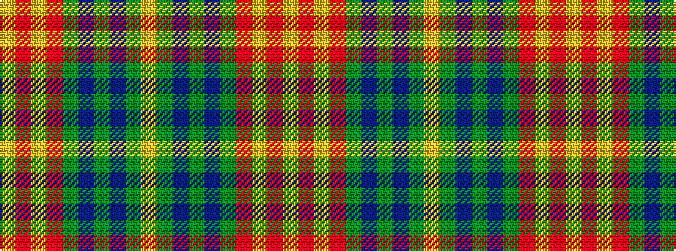

YGBGBGRYRY

It is a 10 stripe tartan.

<figure class="pat-woven">

<figcaption>idealised sample</figcaption>
</figure>

## Colour Sequence



## Tartans with this colour sequence

| Tartans |
|---------------|
| [Rice Welsh Name Tartan](/variants/s10/lo4r21lo1r21y8db4y5db4y4lo4/)|
||
